**MickRobot ** 是一个[开源小车制作项目](https://github.com/RuPingCen/mick_robot_chasiss)，教程内容包含底盘的搭建过程，基于激光雷达的导航内容。项目中小车的3D图、控制板原理图和PCB文件、控制代码均为开源。该项目具有一下特性

- 1）支持两轮差速小车、四轮差速小车、麦克纳姆轮底盘三种底盘运动学模型
- 2）支持DBUS遥控器（大疆DT7遥控器）、SBUS遥控器（RadioLink T8FB）
- 3）配套ROS节点和URDF模型


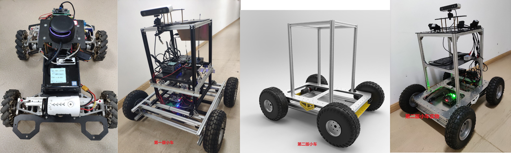


QQ交流群（开源ROS自主导航小车：**1149897304**）


**感谢**：
- 徐久铭师弟帮忙设计小车的机械图以及组装。
- 于力率、温宝愉、舒康设计测试原型控制板。
- 重庆大学机器人与智慧系统实验室（RIS）经费支持。

1、开箱视频，介绍机器人的接线，结构
2、分析控制板的接口
3、分析功能代码：
- DBUS的解码功能
- CAN总线电机读取
- PID控制器
- IMU数据读取
- 上位机通讯，单片机端，ROS端应该如何编写

==注：== 本系列教程中开源的PCB文件、3D模型、相关代码，仅仅供大家自己学习自主导航小车使用，不可用于商业用途。


版本信息 V1.0.0


<div style="page-break-after:always"></div>

#  1、移动底盘简介

	该小车是一款简易的4轮差速小车，通过4个轮毂电机实现小车差速运动，其性能参数如表1所示。小车所有的3D图纸、PCB文件、嵌入式端控制代码全部开源，开源地址：https://github.com/RuPingCen/mick_robot_chasiss。

 


								表1 Mick-V3小车性能指标

|     名称     |        指标         |
| :----------: | :-----------------: |
|   **名称**   |      **指标**       |
|     尺寸     | 600 * 480 * 265 mm  |
|  左右轮轴距  |       400 mm        |
|  前后轮轴距  |       400 mm        |
|   轮胎直径   |    200 mm（8寸）    |
| 最小转弯半径 |          0          |
| 小车最大速度 | 2.2 m/s (250 R/min) |
| 电机额定扭矩 |        7 N.m        |
| 电机峰值扭矩 |       18 N.m        |
|   负载能力   |        ≤40Kg        |
|   续航里程   |        ≥15KM        |
|   充电时长   |      约4-5小时      |


# 2 小车使用说明

## 2.1 小车面板说明

下图所示，小车车尾面板第一排接口从左到右依次为电量显示模块、急停按钮、三色指示灯、电源按钮，面板第二排接口从左到右依次为电池充电口、外部供电接口（24V/10A）、232串口、以太网调试口。面板对外提供24V/10A的电源用作传感器供电，采用GX16-2芯航空插头（1号引脚为VCC，2号引脚为GND，注意面板放电口输出电压为 2.4-29.4V**）。

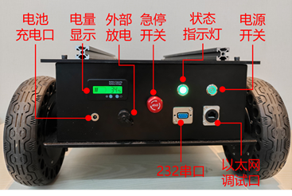

**（1）小车状态指示灯**

小车面板状态指示灯正常情况为绿灯闪烁，部分异常情况如下：

1、若呈现绿灯闪烁同时红灯常亮则代表急停按钮未松开；

2、若在开机的时候出现黄色灯单独快闪则代表小车未收到遥控器信号；

3、若在小车开机时刻出现红灯慢闪4次则表示控制板传感器故障（IMU未初始化）。

 

**（2）以太网调试口**

小车面板上以太网调试口IP地址固定为“192.168.0.7”，将网线连接面板调试口与电脑，配置电脑IP地址为“192.168.0.201”。利用github仓库目录下“Reference_Documents/02_调试工具/网络_串口调试工具.exe”工具，将调试工具默认端口设置为8234，串口波特率为256000，工作模式设置为TCP服务端，即可打印小车调试信息。

小车内部是通过外接串口转以太网模块实现以太网通讯的。再对小车维修时，若设置模块后忘记参数及IP地址。可打开小车外壳，找到如下图所示的串口转以太网模块，通过短接GND与模块上的复位引脚RST(引脚编号为4)进行复位（短接时间≥200ms），网络复位以后网络模块ip默认为192.168.0.7，通讯波特率为115200。模块引脚如下图所示。

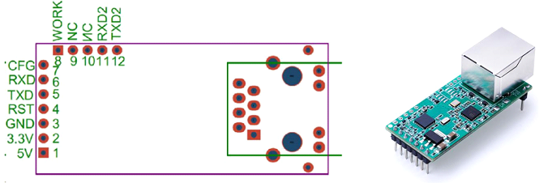


 

**（3）小车底盘充电**

对小车电池充电请使用配套的充电器进行充电！充电时将充电器圆孔插头插入小车面板充电口，充电器功率约为180W，充电器输出电压为24-29.4V,充电时长约为4-5小时。

 

  小车充电器背面与正面

## 2.2 小车固件更新

固件可以通过源代码或者ST-link工具进行更新，源代码更新方式直接使用keil工具编译源代码下载即可。这里主要介绍通过ST-link工具下载编译好的Hex文件。

从ST官方或者本项目的github代码仓库目录（mick_robot_chasiss\Reference_ Documents\01_固件下载）下载烧写软件（STM32 ST-LINK Utility v4.6.0）。STM32 ST-LINK utility安装时候一直下一步默认即可。完成安装以后在桌面上找到如下图标：

                               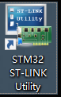

打开软件，使用STLink连接到STM32板子。接下来点击这个插头一样的东西（如果没有识别到就拔插一下STLink下载器）

 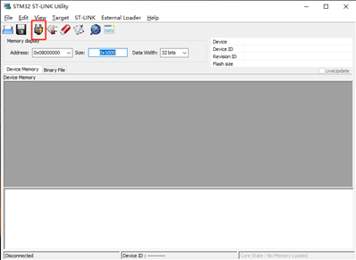

成功以后就可以看到芯片的信息

 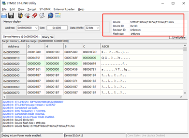

 

接下来选中需要下载的hex文件 xxx.hex

 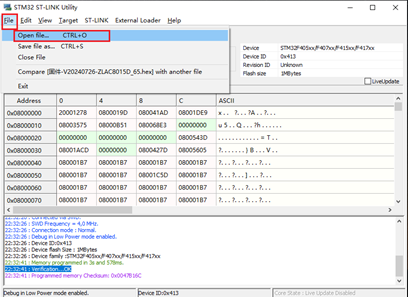

 

成功打开以后这两个地方会有信息提示成功打开文件

 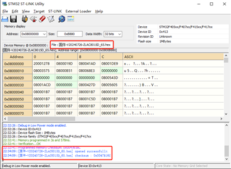

接下来点击烧写程序

 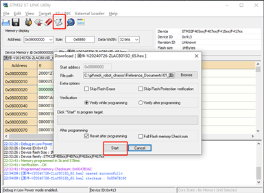

 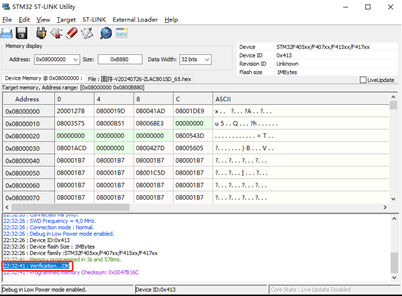

  

## 2.3  遥控器操控说明

四轮差速小车的控制与mick开源项目中其他小车的操做方法一致。默认采用乐迪T8FB遥控器（SBUS协议）

### 2.3.1   遥控器配置方法

**购买整车时遥控器默认已经配置好，不需要再重新配置。**

当自行组装车辆或者更换遥控器时，需利用安卓充电线（micro usb）将遥控器与电脑连接，使用（"Reference\RadioLink_T8FB\T8S-T8FB电脑调参APP V4.2\T8S&T8FB电脑调参APP V4.2"）遥控器自带的APP进行配置。

 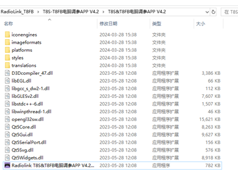     

将第1通道（右手摇杆竖直方向通道）反向，保证摇杆拉到最下方的时候遥控器输出最小值，最上方输出最大值。同时，对于水平方向通道而言，拉到最左边输出最小值，最右方向输出最大值，下图是修改后的状态。

 

 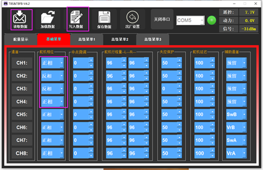

### 2.3.2   遥控器操作说明

这里使用的是左手油门的RadioLink T8FB遥控器。

1. 遥控器**左上角的拨动开关**为功能选择按键：置于L档，即最上方位置，表示开启自动驾驶（遥控器操作无效），置于H档表示由遥控器控制小车，忽略上位机命令。
2. 遥控器**右上角拨动开关**上中下位置分别对应小车1m/s、2m/s、2.2m/s速度。
3. 左手边摇杆竖直方向通道（ch3）控制小车前后运动（如下图所示），右边的摇杆水平通道控制小车左右旋转。

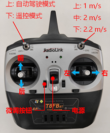

### 2.3.3   遥控器充电

遥控器电池电压低的时候，会发出 “滴滴~”的声响，此时打开后盖将电池取出。**（注意电池插头的正负方向，对应遥控器背后”+“，”—“*标识）**

 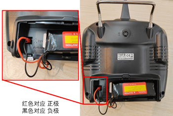

使用配套充电器充电，电池充满以后充电器的灯由红色变为绿色。遥控器充电时需使用遥控器对应的充电器，遥控器电池为2s电池，电池电压范围（6.4V-8.4V）。

 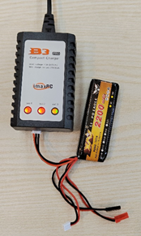

 

## 2.4  小车ROS接口说明

### 2.4.1     ROS1接口

小车ROS1节点https://github.com/RuPingCen/mick_robot_chasiss/tree/master/ROS_Node 

该目录中包含两个文件夹：**mick_bringup**和**mick_description**，**mick_bringup**为小车对应的ROS驱动节点，**mick_description**为urdf模型。

**step1**：将**ROS_Node**放置于ROS工作空间下进行编译

```
cp -r ROS_Node ~/catkin_ws/src   #拷贝文件到ROS工作空间
cd ~/catkin_ws/src
catkin_make
```

**step2**：将小车USB串口连接到电脑，并赋予串口权限

```
sudo chmod 777 /dev/ttyUSB*
```

**step3**：启动ROS节点

```
roslaunch mick_bringup mickrobot-v3.launch
```

小车节点启动以后可以通过rostopic list命令查看到该ROS节点会对外发布如下Topic

 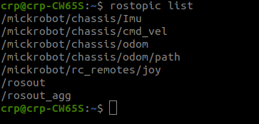

其中：

-  /mickrobot/chassis/Imu 对外发布小车自身IMU测量数据

-  /mickrobot/chassis/odom 小车里程计数据

-  /mickrobot/chassis/odom/path 小车里程计数据对应的路径（默认不发布）

-  /mickrobot/rc_remotes/joy 遥控器数据（默认不发布）

-  /mickrobot/chassis/cmd_vel 小车控制命令接收话题


**step4**: 新建终端，通过ROS话题向 **/mickrobot/chassis/cmd_vel** 话题发布数据 控制小车移动（**注意** **将遥控器左上角拨码开关拨到最上，表示开启自动驾驶模式**）

```
rostopic pub /mickrobot/chassis/cmd_vel -r 10 geometry_msgs/Twist "linear:    x: 0.0    y: 0.0    z: 0.0   angular:    x: 0.0    y: 0.0    z: -0.1"  
```

角速度方向： 逆时针为正，速度方向：车头方向为x方向。

### 2.4.2     ROS2 接口

在系统安装串口库serial：

```
git clone https://github.com/ZhaoXiangBox/serial
cd serial && mkdir build
cmake .. && make
sudo make install
```

将ROS的驱动板拷贝到工作空间下，进入工作空间主目录:

```
cd bringup_ws
```

使用colcon build进行编译:

```
colcon build
```

在运行之前，由于节点里面涉及到串口的打开，因此需要先打开串口权限:

```
sudo chmod 777 /dev/ttyUSB0
```

最后在编译无报错之后就可以运行了:

```
sourse install/setup.bash
ros2 run mick_bringup mick_node
```

ROS2输出的话题名称及消息定义均与ROS1接口一致。

 

注：可以将小车垫高，随后在命令行终端里输入以下指令：

```
ros2 topic pub -r 100 /cmd_vel geometry_msgs/msg/Twist "{linear: {x: 1.0, y: 0.0, z: 0.0}, angular: {x: 0.0, y: 0.0, z: 0.0}}"
```

 

## 2.5 小车底盘通讯协议

小车底盘与PC机通过串口连接，为增强底盘的通用性，若需要不依赖ROS中间件，可以向串口设备按照以下约定的协议发送数据，也可实现小车控制。底盘的通讯接口可参考在线文档：

https://docs.qq.com/sheet/DV2hmSEdSYVVtclB4?tab=bb08j2

### 2.5.1   命令下发接口

如表2-1所示差速底盘速度控制模式下，指令发送的格式为

								表2-1 MickX4差速小车速度控制指令

| **帧头** | **帧长度** | **命令字** | **数据** | **校验位**               | **帧尾**          |                            |                |                |            |        |        |
| -------- | ---------- | ---------- | -------- | ------------------------ | ----------------- | -------------------------- | -------------- | -------------- | ---------- | ------ | ------ |
| Byte0    | Byte1      | Byte2      | Byte3    | Byte[4:5]                | Byte[6:7]         | Byte[8:9]                  | Byte10         | Byte11         | Byte12     | Byte13 | Byte14 |
| 0XAE     | 0xEA       | 1 Byte     | 0xF3     | **X方向速度（0.01m/s）** | **Y方向速度0x00** | **旋转角速度(0.01 rad/s)** | 保留字（0x00） | 保留字（0x00） | 数据校验位 | 0XEF   | 0xFE   |

 

1) **Byte[0:1]**：uint8类型数据，表示数据帧头，固定值0XAE、0xEA。
2) **Byte[2]**：uint8类型数据，表示数据帧长度，数据长度=自身长度（1个字节）+命令类型（1个字节）+数据（N个字节）+校验位（1个字节）（即除帧头帧尾以外的所有数据位）
3) **Byte[3]**：uint8类型数据，控制命令0xF3表示针对差速底盘下发速度指令控制
4) **Byte[4:5]** : uint16类型数据，高位在前，X表示小车底盘x方向（车头方向）速度，在发送的时候需要进行手动偏移，偏移量为10m/s,同时将待发送的速度量speed_x放大100倍，将其转为正数进行发送。
5) **Byte[6:7]** :uint16类型数据，表示小车底盘y方向（车头方向）速度，差速底盘上设置无效，默认为0；
6) **Byte[7:8]** :uint16类型数据，表示小车底盘旋转角速度，单位0.01rad/s ，偏移量为10 rad/s；
7) **Byte[10:11]** 两个字节为保留字，固定为0x00;
8) **Byte[12]**：数据校验位，数据校验位=数据长度+命令类型+所有的数据位（取结果的低8位）；
9) **Byte[13:14]**：表示数据帧尾，固定值0XEF、0xFE;

 

表2-2列举其他控制器向底盘发送控制指令的样例函数

表2-2 MickX4差速小车速度控制指令发送函数示例

```
void send_speed_to_X4chassis(float x,float y,float w)
{
	uint8_t data_tem[50];
	unsigned int speed_0ffset=10; //速度偏移值 10ｍ/s，把速度转换成正数发送
	unsigned char i,counter=0;	 
	unsigned int check=0;

	data_tem[counter++] =0xAE;
	data_tem[counter++] =0xEA;
	data_tem[counter++] =0x0B;
	data_tem[counter++] = 0xF3; //针对MickX4的小车使用F3 字段 
	data_tem[counter++] =((x+speed_0ffset)*100)/256; // X
	data_tem[counter++] =((x+speed_0ffset)*100);
	data_tem[counter++] =((y+speed_0ffset)*100)/256; // Y
	data_tem[counter++] =((y+speed_0ffset)*100);
	data_tem[counter++] =((w+speed_0ffset)*100)/256; // X
	data_tem[counter++] =((w+speed_0ffset)*100);
	data_tem[counter++] =0x00; //保留字
	data_tem[counter++] =0x00;
	data_tem[2] =counter-2;
	for(i=2;i<counter;i++) // 计算校验值
	{
		check+=data_tem[i];
	}
	data_tem[counter++] =0xEF;
	data_tem[counter++] =0xFE;
	ros_ser.write(data_tem,counter);
}

```

 

数据下发示例：假设下发的速度x=1m/s,则下发的实际值=(1m/s+10)*100 = 1100,对应16进制为0x044C；y=0 m/s,则下发的实际值=(0 m/s+10)*100 = 1000,对应16进制为0x03E8;角速度w=0 rad/s,则下发的实际值=(0 rad/s+10)*100 = 1000。对应16进制为0x03E8;发送数据时采用大端模式，即高位在前。

```
AE EA 0B F3 04 4C 03 E8 03 E8 00 00 39 EF FE
```

 

### 2.5.2   数据上传协议

#### 2.5.2.1 里程计数据上传

底盘向上位机发送数据的命令字为0xA7，其中上传的里程计数据包含小车车体坐标系下，X方向速度（0.001m/s），Y方向速度（差速底盘固定为0，0.001m/s），绕小车旋转的角速度（逆时针为正0.001rad/s）

								表2-3 MickX4差速小车里程计数据上传指令

| 帧头    | 帧长度  | 命令字  | **数据** | 校验位  Byte[12]           | 帧尾  Byte[13:14]  |                            |            |          |         |
| ------- | ------- | ------- | -------- | -------------------------- | ------------------ | -------------------------- | ---------- | -------- | ------- |
| Byte[0] | Byte[1] | Byte[2] | Byte[3]  | Byte[4:5]                  | Byte[6:7]          | Byte[8:9]                  | Byte[12]   | Byte[13] | Byte14] |
| 0XAE    | 0xEA    | 1 Byte  | 0xA7     | **X方向速度（0.001*m/s）** | **Y方向速度 0x00** | **旋转角速度0.001 rad/s)** | 数据校验位 | 0XEF     | 0xFE    |

 

1) **Byte[0:1]**：uint8类型数据，表示数据帧头，固定值0XAE、0xEA。
2) **Byte[2]**：uint8类型数据，表示数据帧长度，数据长度=自身长度（1个字节）+命令类型（1个字节）+数据（N个字节）+校验位（1个字节）（即除帧头帧尾以外的所有数据位）
3) **Byte[3]**：uint8类型数据，控制命令0xF3表示针对差速底盘下发速度指令控制
4) **Byte[4:5]** : int16类型数据，高位在前，X表示小车底盘x方向（车头方向）速度,单位为0.001m/s。
5) **Byte[6:7]** :int16类型数据，表示小车底盘y方向（车头方向）速度，差速底盘上设置无效，默认为0；
6) **Byte[7:8]** :int16类型数据，表示小车底盘旋转角速度，单位0.001rad/s；
7) **Byte[9]**：数据校验位，数据校验位=数据长度+命令类型+所有的数据位（取结果的低8位）；
8) **Byte[10]**：表示数据帧尾，固定值0XEF、0xFE;

 

								表2-4 MickX4差速小车里程计上传函数

```
void Chassis_Odom_Upload_Message(float odom_vx, float odom_vy, float odom_w)
{
	unsigned char senddata[25];
	unsigned char i=0,j=0;	
	unsigned int sum=0x00;	
	int16_t tem =0;
	
	senddata[i++]=0xAE;
	senddata[i++]=0xEA;
	senddata[i++]=0x01;//数据长度在后面赋值
	senddata[i++]=0xA7; //命令字

	tem = (int16_t)((odom_vx*1000)/1); //odom_vx最大值65.535
	senddata[i++] = tem>>8;
	senddata[i++] = tem;
	tem = (int16_t)((odom_vy*1000)/1);
	senddata[i++] = tem>>8;
	senddata[i++] = tem;
	tem = (int16_t)((odom_w*1000)/1);
	senddata[i++] = tem>>8;
	senddata[i++] = tem;
	
	senddata[2]=i-1; //数据长度
	for(j=2;j<i;j++)
		sum+=senddata[j];
	
	senddata[i++]=sum;
	senddata[i++]=0xEF;
	senddata[i++]=0xFE;

	UART_send_buffer(USART1,senddata,i);
}

```

 

其中：odom_vx, odom_vy, odom_w分别表示小车车体坐标系下x方向速度，y方向速度以及旋转角速度。

 

#### 2.5.2.2 IMU数据上传协议

小车控制板安装有型号为MPU6050的6轴惯性测量单元，对外提供控制板自身的加速度和陀螺仪测量值。

表2-3 MickX4差速小车板载IMU数据上传指令

| **帧头** | **帧长度** | **命令字** | **IMU****数据** | **校验位**                     | **帧尾**                    |                                         |                                     |          |          |          |
| -------- | ---------- | ---------- | --------------- | ------------------------------ | --------------------------- | --------------------------------------- | ----------------------------------- | -------- | -------- | -------- |
| Byte[0]  | Byte[1]    | Byte[2]    | Byte[3]         | Byte[4:9]                      | Byte[10:15]                 | Byte[16:21]                             | Byte[22:27]                         | Byte[28] | Byte[29] | Byte[30] |
| 0XAE     | 0xEA       | 1 Byte     | 0xA0            | **x,y,z轴 加速度（原始数据）** | **x,y,z角速度（原始数据）** | **x,y,z轴磁力计  （原始数据、保留位）** | **Roll-Pitch-Yaw 欧拉角（0.01度）** | 校验位   | 0XEF     | 0xFE     |

 

1) **Byte[0:1]**：uint8类型数据，表示数据帧头，固定值0XAE、0xEA。
2) **Byte[2]**：uint8类型数据，表示数据帧长度，数据长度=自身长度（1个字节）+命令类型（1个字节）+数据（N个字节）+校验位（1个字节）（即除帧头帧尾以外的所有数据位）
3) **Byte[3]**：uint8类型数据，控制命令0xA0表示底盘向PC端发送IMU测量数据帧
4) **Byte[4:5]:** int16类型，高位在前，x轴方向加速度原始输出数据；
5) **Byte[6:7]:** int16类型，高位在前，y轴方向加速度原始输出数据；
6) **Byte[8:9]:** int16类型，高位在前，z轴方向加速度原始输出数据；
7) **Byte[10:11]:** int16类型，高位在前，绕x轴旋转角速度原始输出数据；
8) **Byte[12:13]:** int16类型，高位在前，绕y轴旋转角速度原始输出数据；
9) **Byte[14:15]:** int16类型，高位在前，绕z轴旋转角速度原始输出数据；
10) **Byte[16:17]:** int16类型，高位在前，x轴磁场原始输出数据；(保留)
11) **Byte[18:19]:** int16类型，高位在前，y轴磁场原始输出数据；(保留)
12) **Byte[20:21]:** int16类型，高位在前，z轴磁场原始输出数据；(保留)
13) **Byte[22:23]:** int16类型，高位在前，欧拉角，Roll角，单位0.01度；
14) **Byte[24:25]:** int16类型，高位在前，欧拉角，Pitch角，单位0.01度；
15) **Byte[26:27]:** int16类型，高位在前，欧拉角，Yaw角，单位0.01度；
16) **Byte[28]**：数据校验位，数据校验位=数据长度+命令类型+所有的数据位（取结果的低8位）；
17) **Byte[29:30]**：表示数据帧尾，固定值0XEF、0xFE;

 

#### 2.5.2.3 遥控器数据协议

小车遥控器数据上传使用命令字0xA3。

									表2-3 MickX4差速小车遥控器数据上传指令

| **帧头** | **帧长度** | **命令字** | **IMU****数据** | **校验位**                           | **帧尾**                             |                                |            |            |          |          |          |
| -------- | ---------- | ---------- | --------------- | ------------------------------------ | ------------------------------------ | ------------------------------ | ---------- | ---------- | -------- | -------- | -------- |
| Byte[0]  | Byte[1]    | Byte[2]    | Byte[3]         | Byte[4:11]                           | Byte[12:15]                          | Byte[16]                       | Byte[17]   | Byte[18]   | Byte[19] | Byte[20] | Byte[21] |
| 0XAE     | 0xEA       | 1 Byte     | 0xA3            | **ch1-ch4**  **(每个通道占用2字节)** | **SW1-SW4**  **(每个通道占用1字节)** | **Type**  **遥控器**  **类型** | **错误码** | **保留字** | 校验位   | 0XEF     | 0xFE     |

 

1) **Byte[0:1]**：uint8类型数据，表示数据帧头，固定值0XAE、0xEA。
2) **Byte[2]**：uint8类型数据，表示数据帧长度，数据长度=自身长度（1个字节）+命令类型（1个字节）+数据（N个字节）+校验位（1个字节）（即除帧头帧尾以外的所有数据位）；
3) **Byte[3]**：uint8类型数据，控制命令0xA3表示底盘向PC端发送遥控器测量数据帧；
4) **Byte[4:5]:** int16类型，高位在前，遥控器Ch1摇杆通道原始输出数据；
5) **Byte[6:7]:** int16类型，高位在前，遥控器Ch2摇杆通道原始输出数据；
6) **Byte[8:9]:** int16类型，高位在前，遥控器Ch3摇杆通道原始输出数据；
7) **Byte[10:11]:** int16类型，高位在前，遥控器Ch4摇杆通道原始输出数据；
8) **Byte[12]:** uint8类型，高位在前，遥控器SW1拨动开关原始输出数据；
9) **Byte[13]:** uint8类型，高位在前，遥控器SW2拨动开关原始输出数据；
10) **Byte[14]:** uint8类型，高位在前，遥控器SW3拨动开关原始输出数据；
11) **Byte[15]:** uint8类型，高位在前，遥控器SW4拨动开关原始输出数据；
12) **Byte[15]:** uint8类型， Type-遥控器类型（1:DJI-DBUS 2:SBUS）;
13) **Byte[16]:** uint8类型，错误码((0x00表示在正常，0xA1通讯丢失); 
14) **Byte[17]:** uint8类型，保留字(0x00)
15) **Byte[18]**：数据校验位，数据校验位=数据长度+命令类型+所有的数据位（取结果的低8位）；
16) **Byte[20:21]**：表示数据帧尾，固定值0XEF、0xFE;

 

#### 2.5.2.4 GPIO状态上传

小车控制板输入/输出端口状态数据上传使用命令字0xAC。

表2-3 MickX4差速小车输入输出端口状态数据上传指令

| **帧头** | **帧长度** | **命令字** | **端口数据** | **校验位**                    | **帧尾**                      |         |         |         |
| -------- | ---------- | ---------- | ------------ | ----------------------------- | ----------------------------- | ------- | ------- | ------- |
| Byte[0]  | Byte[1]    | Byte[2]    | Byte[3]      | Byte[4]                       | Byte[5]                       | Byte[6] | Byte[7] | Byte[8] |
| 0XAE     | 0xEA       | 1 Byte     | 0xAC         | **输入端口**  **(占用1字节)** | **输出端口**  **(占用1字节)** | 校验位  | 0XEF    | 0xFE    |

 

1) **Byte[0:1]**：uint8类型数据，表示数据帧头，固定值0XAE、0xEA。
2) **Byte[2]**：uint8类型数据，表示数据帧长度，数据长度=自身长度（1个字节）+命令类型（1个字节）+数据（N个字节）+校验位（1个字节）（即除帧头帧尾以外的所有数据位）；
3) **Byte[3]**：uint8类型数据，控制命令0xAC表示底盘向PC端发送遥控器测量数据帧；
4) **Byte[4]:** uint8类型，输入端口；每一个bit位对应一个通道，例如bit0表示通道0的状态。每一个bit位上数据0 表示端口电平为0电平，数据1表示端口电平是1电平。
5) **Byte[5]:** uint8类型，输输出端口；每一个bit位对应一个通道，例如bit0表示通道0的状态。每一个bit位上数据0 表示端口电平为0电平，数据1表示端口电平是1电平。
6) **Byte[6]**：数据校验位，数据校验位=数据长度+命令类型+所有的数据位（取结果的低8位）；
7) **Byte[7:8]**：表示数据帧尾，固定值0XEF、0xFE;

## 2.6 扩展支架尺寸

小车上面版有两个20型材可做为外部固定支架，型材中心间距为213mm,车头方向有安装孔阵列作为备用，安装孔从中心线出发间隔45mm向两侧扩展，以间距50mm沿纵向方向扩展。

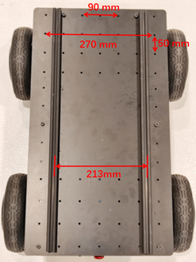

 

 

 


 
